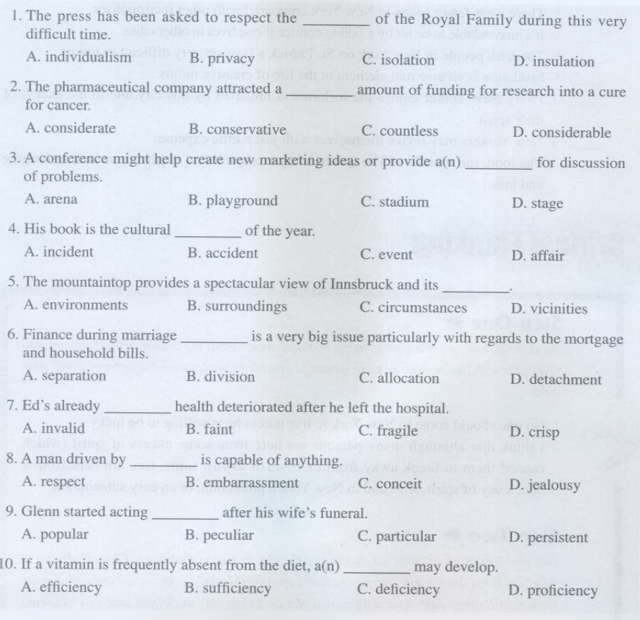
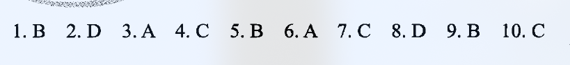
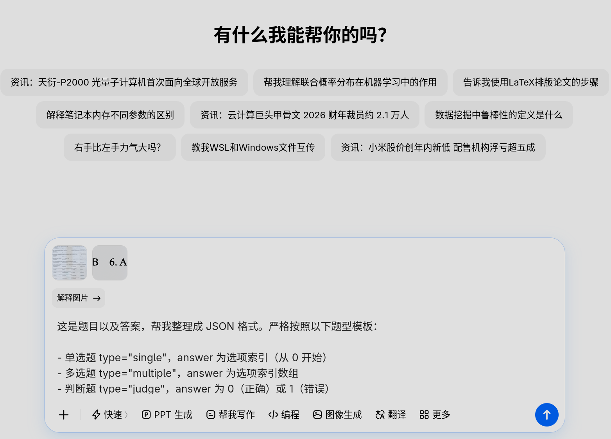
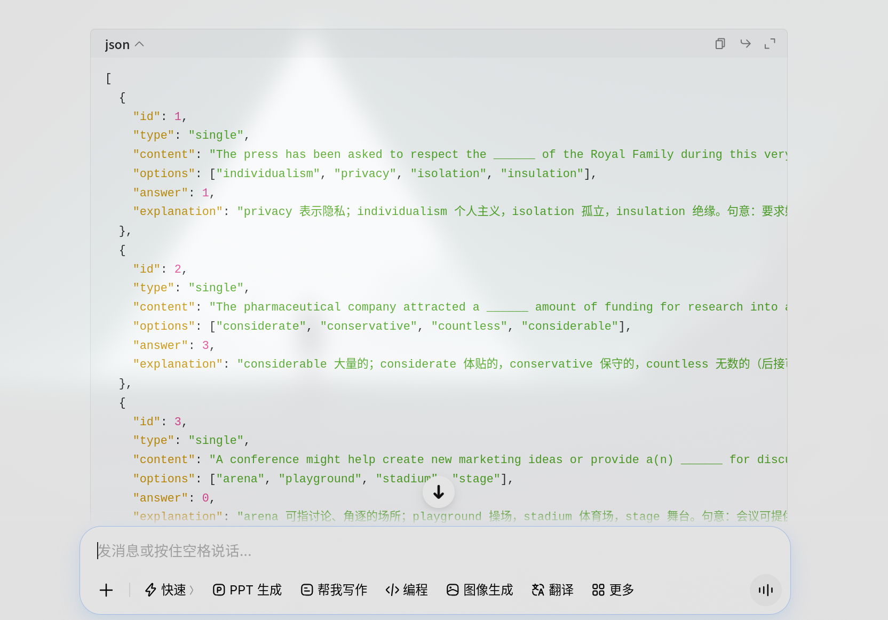
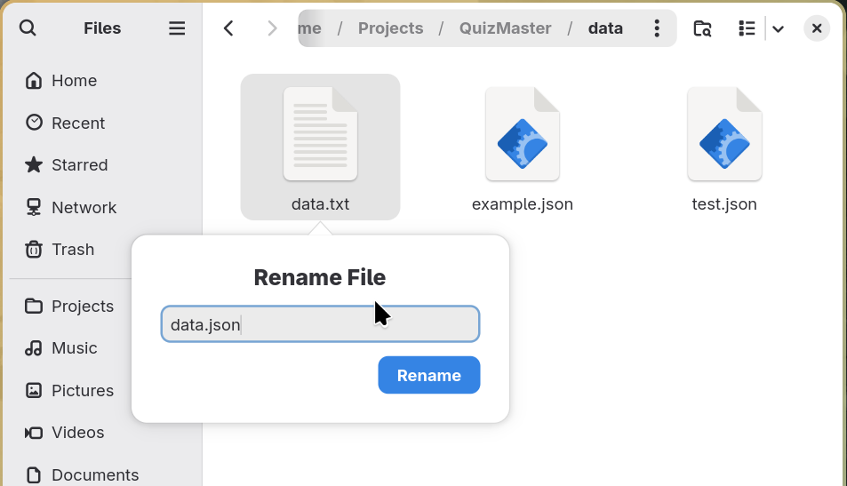
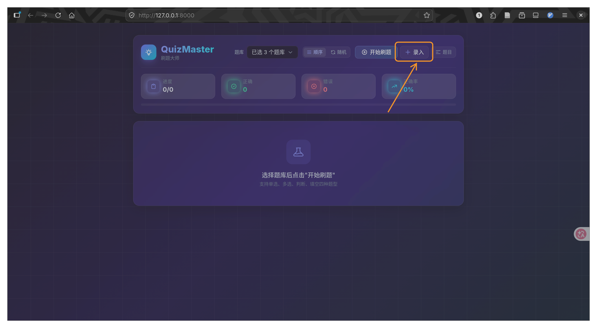
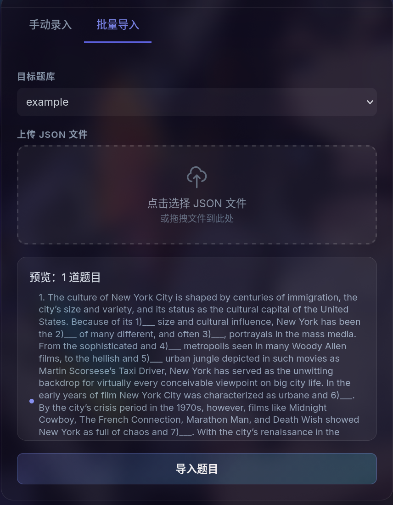

# QuizMaster - 刷题大师

极简轻量级刷题网站，基于 FastAPI + 原生 JavaScript 构建。

## 项目结构

```
QuizMaster/
├── main.py              # FastAPI 后端
├── requirements.txt     # Python 依赖
├── data/                # 题库文件夹（.json 文件即题库）
│   ├── example.json     # 示例题库（含所有题型模板）
│   ├── test.json        # 测试题库
│   ├── cloze.json       # 完形填空题库
│   └── Single.json      # 自定义题库
├── static/              # 静态文件
│   └── index.html       # 前端页面（单文件应用）
└── images/              # 文档图片
```

## 快速启动

### 1. 安装依赖

```bash
pip install -r requirements.txt
```

### 2. 启动服务

```bash
python main.py
```

或使用 uvicorn 直接启动：

```bash
uvicorn main:app --reload --host 0.0.0.0 --port 8000
```

### 3. 访问应用

打开浏览器访问：`http://localhost:8000`

## 功能说明

### 题库管理
- 后端自动扫描 `data/` 目录下的所有 `.json` 文件作为题库
- 支持通过前端多选下拉菜单切换 / 合并多个题库
- 支持顺序刷题和随机刷题两种模式

### 题目录入
- **手动录入**：支持单选、多选、判断、填空、完形填空五种题型
- **JSON 批量导入**：上传 JSON 文件批量导入题目（拖拽或点击上传）

### 刷题功能
- 单题模式，自动判分
- 进度统计（已答 / 正确 / 错误 / 正确率）
- 答题后显示解析（如有）
- 正确 / 错误答案分别标绿 / 标红反馈
- 侧边栏题目列表，支持快速跳转
- 题目编辑 / 删除

## 题库 JSON 格式

### 单选题（single）

```json
{
  "id": 1,
  "type": "single",
  "content": "Python 中用于定义函数的关键字是？",
  "options": ["function", "def", "func", "define"],
  "answer": 1,
  "explanation": "Python 使用 def 关键字来定义函数。"
}
```

### 多选题（multiple）

```json
{
  "id": 2,
  "type": "multiple",
  "content": "以下哪些是 JavaScript 的数据类型？（多选）",
  "options": ["String", "Number", "Boolean", "Character"],
  "answer": [0, 1, 2],
  "explanation": "没有单独的 Character 类型。"
}
```

### 判断题（judge）

```json
{
  "id": 3,
  "type": "judge",
  "content": "HTML 是一种编程语言。",
  "options": ["正确", "错误"],
  "answer": 1,
  "explanation": "HTML 是标记语言，不是编程语言。"
}
```

### 填空题（fill）

```json
{
  "id": 4,
  "type": "fill",
  "content": "HTTP 协议中，成功响应的状态码是______。",
  "answer": ["200", "200 OK"],
  "explanation": "HTTP 200 表示请求成功。"
}
```

### 完形填空（cloze）

```json
{
  "id": 5,
  "type": "cloze",
  "content": "English is a global language. It is ___ by millions of people. Learning English can ___ many doors.",
  "options": ["spoken", "open", "practice", "listening"],
  "answer": [0, 1],
  "explanation": "空格1: spoken; 空格2: open。"
}
```

> ⚠️ 完形填空中用 `___`（三个下划线）标记挖空位置，`answer` 为整数数组，`answer[i]` 表示第 `i` 个空对应的选项索引（A=0, B=1, ...）。

### 题型速查

| 类型 | type 值 | answer 格式 | 示例 |
|------|---------|-------------|------|
| 单选 | `single` | 数字索引 | `1` |
| 多选 | `multiple` | 数字数组 | `[0, 2]` |
| 判断 | `judge` | `0`（正确）或 `1`（错误） | `1` |
| 填空 | `fill` | 字符串或字符串数组 | `"200"` 或 `["200", "200 OK"]` |
| 完形填空 | `cloze` | 数字数组（按空顺序） | `[2, 0, 1]` |

## 如何批量制作题库

### 方法一：通过网站上传

1. 准备好 JSON 格式的题库文件（参考上方格式）
2. 打开网站，点击 **录入** → **批量导入**
3. 选择目标题库，上传 JSON 文件
4. 预览确认后点击 **导入题目**

### 方法二：直接放入 data 目录

将 `.json` 文件直接放入项目 `data/` 目录下，刷新页面即可自动识别。

### 方法三：用 AI 生成题库

**步骤 1** — 准备好题目和答案（截图发给 AI 最方便）：

| 题目 | 答案 |
|------|------|
|  |  |

**步骤 2** — 将截图发给 AI（ChatGPT / Claude 等），使用以下提示词：



```text
这是题目以及答案，帮我整理成 JSON 格式。严格按照以下题型模板：

- 单选题 type="single"，answer 为选项索引（从 0 开始）
- 多选题 type="multiple"，answer 为选项索引数组
- 判断题 type="judge"，answer 为 0（正确）或 1（错误）
- 填空题 type="fill"，answer 为字符串或字符串数组
- 完形填空 type="cloze"，题干用 ___ 标记挖空，answer 为每个空对应选项的索引数组

模板示例：
```json
[
  {
    "id": 1,
    "type": "single",
    "content": "题目内容",
    "options": ["选项A", "选项B", "选项C", "选项D"],
    "answer": 1,
    "explanation": "解析（可选）"
  },
  {
    "id": 2,
    "type": "multiple",
    "content": "题目内容",
    "options": ["选项A", "选项B", "选项C", "选项D"],
    "answer": [0, 2],
    "explanation": "解析（可选）"
  },
  {
    "id": 3,
    "type": "judge",
    "content": "题目内容",
    "options": ["正确", "错误"],
    "answer": 0,
    "explanation": "解析（可选）"
  },
  {
    "id": 4,
    "type": "fill",
    "content": "题干中用______表示填空位置",
    "answer": ["答案1", "答案2"],
    "explanation": "解析（可选）"
  },
  {
    "id": 5,
    "type": "cloze",
    "content": "题干中用 ___ 标记挖空位置，每个空对应一个选项。如：It is ___ by people. It can ___ doors.",
    "options": ["spoken", "open", "practice"],
    "answer": [0, 1],
    "explanation": "解析（可选）"
  }
]
```

**步骤 3** — AI 输出格式化后的 JSON，复制全部内容：



**步骤 4** — 新建 `.txt` 文件，粘贴内容，保存后将后缀改为 `.json`：



**步骤 5** — 将 `.json` 文件放入 `data/` 目录，或通过网站上传：




